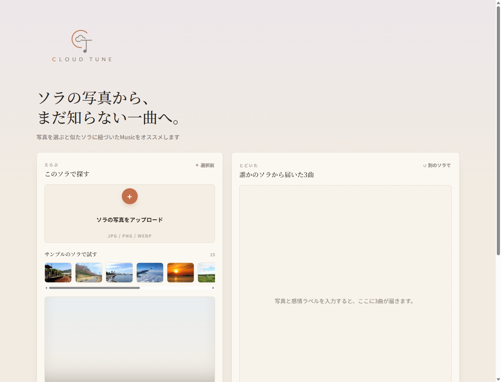
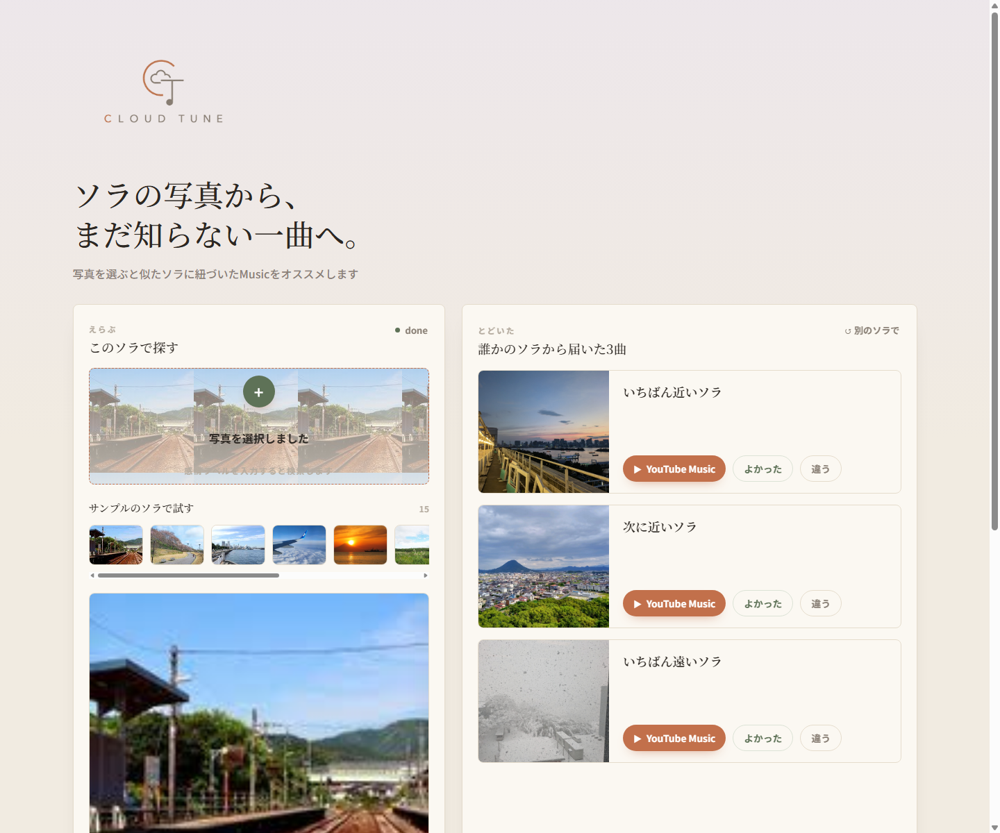
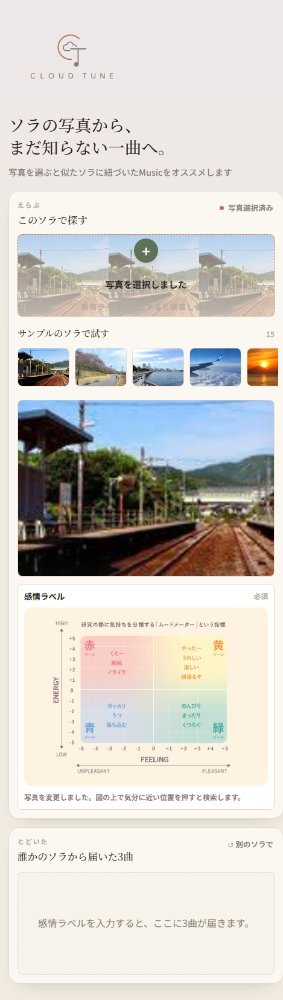
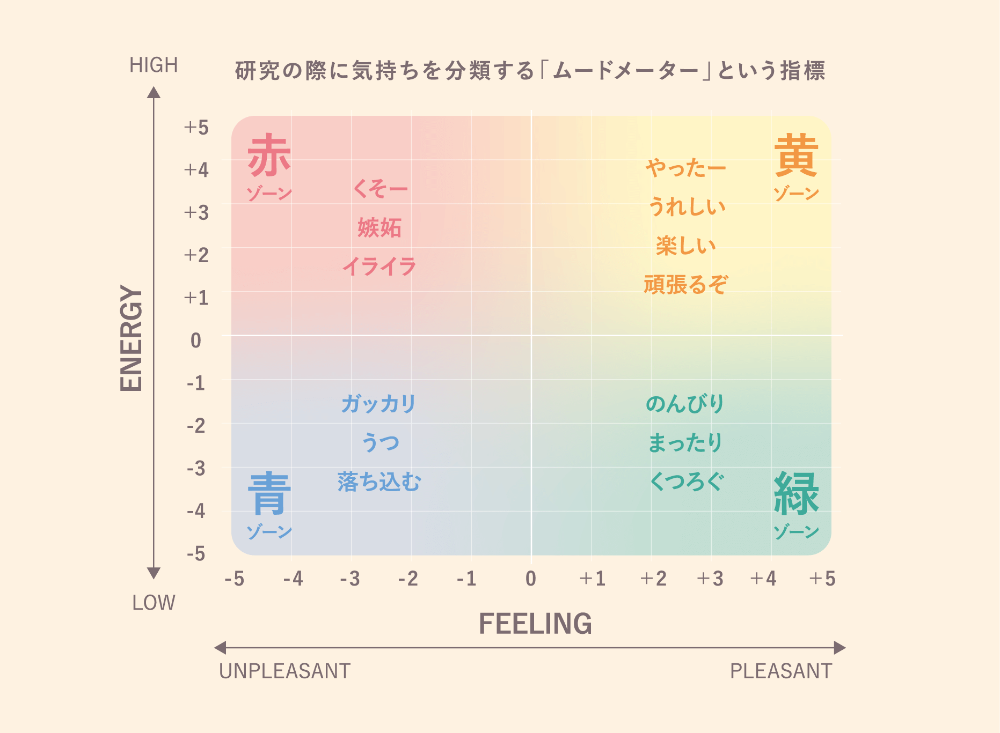

# Cloud Tune

空の写真と感情ラベルから、似た空に紐づいた **YouTube Music** のリンクを届けるWebアプリです。

音楽そのものは解析しません。

過去に誰かが残した「空の写真 + YouTube Musicリンク」の対応をたどり、いま選んだ空に近い一曲へ出会う体験を作ります。

## コンセプト

> 空の写真から、まだ知らない一曲へ。

Cloud Tune は「曲を当てるAI」ではありません。

写真全体の雰囲気と感情ラベルを手がかりに、似た空を見た誰かが残した曲を推薦します。

大事にしている体験は次の3つです。

- 自分の空を入口にする
- 似た空を見た誰かの選曲に出会う
- 正解の1曲ではなく、少し偶然を含んだ3曲を受け取る

## 画面イメージ

### PC表示



### 推薦結果



### スマホ表示



### 感情ラベル

研究室での気分入力を想定し、赤・黄・青・緑の4ゾーンを持つムードメーターを使います。

色のついたゾーン内だけをクリックでき、クリック位置から `feeling_score` と `energy_score` を作ります。



## 主な機能

- 空写真のアップロード
- サンプル空画像からの即時テスト
- 感情ラベルの入力
- 似た空に紐づいたYouTube Musicリンクの推薦
- 3枠推薦
  - いちばん近い空
  - 同じ気配の空
  - 寄り道の空
- YouTube Musicリンクへの遷移
- 「よかった / 違う」のフィードバック
- ユーザー投稿による「空 + YouTube Musicリンク」の登録
- PC / スマホ対応UI

## 使い方

1. 空の写真をアップロードする、またはサンプルの空を選ぶ
2. 感情ラベルの図から、いまの気分に近い位置を選ぶ
3. 似た空から届いた3曲を見る
4. 気に入った曲をYouTube Musicで開く
5. 必要なら、自分の空に合うYouTube Musicリンクを登録する

## 推薦の考え方

Cloud Tune は音楽を直接解析しません。

推薦の中心は、写真側の説明可能な特徴量と、人が登録した対応関係です。

### 1. 写真全体の雰囲気を読む

写真の上部だけを切り出すのではなく、建物・木・雪・道なども含めた「写真全体の雰囲気」を使います。

これは、空そのものだけでなく、その場の気配も曲選びに影響すると考えているためです。

主に使う特徴量:

- 明るさ
- 彩度
- 青さ
- 暖色感
- グレー感
- 暗さ
- コントラスト
- 粗さ

### 2. 空模様の軸を足す

写真全体に加えて、上1/3の領域から空模様の特徴も見ます。

- `sky_clear`: 抜け感
- `sky_cloud`: 雲量
- `sky_texture`: 雲の細かさ
- `sky_warm`: 夕方感
- `sky_blue`: 空の青さ

施設や地面が入りすぎないよう、空模様の軸は上1/3を使います。

### 3. 4x4のレイアウト特徴を使う

写真を4x4のグリッドに分け、それぞれの場所で色やエッジの特徴を取ります。

これはGIST / Spatial Envelopeの考え方に近く、写真全体のざっくりした配置を捉えるための軽量な実装です。

### 4. 感情ラベルを加味する

ムードメーター上の位置から、次の2軸を得ます。

- `feeling_score`: 不快から快へ
- `energy_score`: 低エネルギーから高エネルギーへ

推薦では、写真特徴の近さに加えて、感情ラベルの近さも使います。

### 5. 3曲に再ランキングする

単に一番近い1件だけを返すのではなく、3つの枠で推薦します。

| 枠 | 役割 |
| --- | --- |
| いちばん近い空 | 写真と感情が最も近い候補 |
| 同じ気配の空 | 少し違うが雰囲気が近い候補 |
| 寄り道の空 | 近すぎない偶然性を含む候補 |

この設計により、「正解を当てる」よりも「知らない曲に出会う」体験を優先しています。

## 技術構成

```text
Frontend:
  HTML / CSS / JavaScript

Backend:
  Python
  FastAPI
  SQLite
  Pillow
  NumPy

Data:
  空写真
  YouTube Musicリンク
  画像特徴量
  感情ラベル
  推薦ログ
  フィードバック
```

## ディレクトリ構成

```text
app/
  index.html              # フロントエンド
  styles.css              # UI
  app.js                  # 画面操作・API通信
  mood_meter.png          # 感情ラベル入力用の図
  cloud_tune_logo.png     # ロゴ

backend/cloud_tune/
  main.py                 # FastAPIエントリポイント
  features.py             # 画像特徴量抽出
  recommender.py          # 推薦ロジック
  db.py                   # SQLite初期化・JSON補助
  __init__.py

data/
  photos/                 # 取り込み済み写真
  uploads/                # ユーザーアップロード
  test_queries/           # テスト用画像

docs/images/
  README用スクリーンショット
```

## セットアップ

Windows PowerShellの例です。

```powershell
python -m venv .venv
.\.venv\Scripts\Activate.ps1
pip install -r requirements.txt

$env:CLOUD_TUNE_WORKSPACE=(Get-Location).Path
$env:PYTHONPATH="$((Get-Location).Path)\backend"

uvicorn cloud_tune.main:app --host 0.0.0.0 --port 8000
```

起動後、ブラウザで開きます。

```text
http://localhost:8000/
```

## API

| Method | Path | 内容 |
| --- | --- | --- |
| `GET` | `/health` | ヘルスチェック |
| `GET` | `/api/stats` | 登録件数などの確認 |
| `GET` | `/api/test-images` | サンプル画像一覧 |
| `POST` | `/api/recommend` | 画像 + 感情ラベルから推薦 |
| `POST` | `/api/register` | 空写真 + YouTube Musicリンクを登録 |
| `POST` | `/api/feedback` | よかった / 違う / clicked を記録 |
| `GET` | `/api/photos/{photo_id}/image` | 登録写真の取得 |

## データについて

このリポジトリには、実データのSQLite DBや取り込み済み写真は含めていません。

Git管理しないもの:

- `data/*.sqlite3`
- `data/photos/*`
- `data/uploads/*`
- `data/test_queries/*`

必要な場合は、別途データを用意してから `data/` 配下に置いてください。

## YouTubeリンクの扱い

- YouTube Musicのリンクを保存します
- YouTubeの音源ファイルは保存しません
- YouTubeのメタデータも保存しません
- 曲の解析は行いません

## ハッカソンでの説明用

短く説明するなら:

> 空の写真をアップロードすると、似た空を見た誰かが残したYouTube Musicの一曲に出会えるアプリです。

技術的に説明するなら:

> 写真全体の雰囲気、上1/3の空模様、4x4のレイアウト特徴、感情ラベルを使って、登録済みの空写真から近いものを探します。音楽は解析せず、人が残した対応関係をたどります。

研究っぽく説明するなら:

> 音楽側を解析しない content-free な制約のもとで、人間が作ったクロスモーダル対応を、説明可能な画像特徴量とセレンディピティ重視の再ランキングで再利用する推薦システムです。
